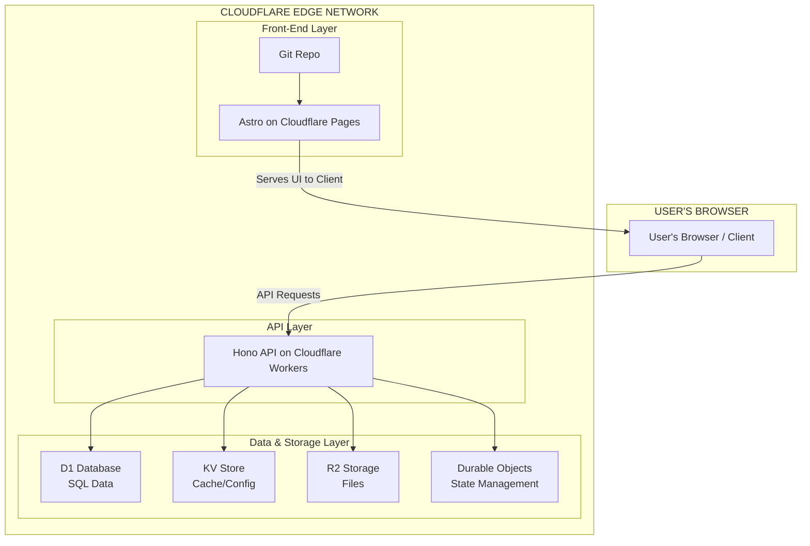
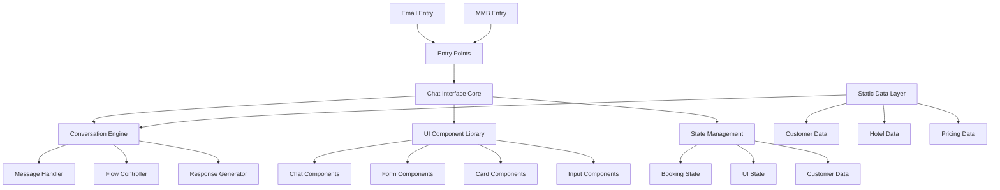

# Design Document

## Overview

The Qatar Airways Stopover AI Agent is designed as a modern, conversational web application that seamlessly integrates into existing Qatar Airways customer touchpoints. The system employs a sophisticated chat interface with multi-modal input capabilities, rich content rendering, and responsive design principles to deliver an intuitive stopover booking experience.

The architecture follows a component-based approach with clear separation between presentation, interaction logic, and data management layers. The design prioritizes user experience through progressive disclosure, contextual guidance, and consistent brand adherence while maintaining the flexibility to handle various user interaction patterns.

## Requirements Coverage

This design addresses all 13 user stories from the requirements document:

**Requirement 1** - Multiple entry points supported through EmailTemplate and MMBPage components with floating chat integration
**Requirement 2** - Multi-modal interaction enabled via MultiModalInput component supporting text, voice, and button inputs
**Requirement 3** - Stopover category selection through StopoverCategoryCarousel component with four category options
**Requirement 4** - Hotel selection through HotelCarousel component with five premium category hotels
**Requirement 5** - Timing and duration selection via StopoverOptions component with radio buttons and duration picker
**Requirement 6** - Automatic tour recommendation via enhanced StopoverExtras component with "Whale Sharks of Qatar" featured display
**Requirement 7** - Optional extras management through StopoverExtras and ToursCarousel components with basket functionality
**Requirement 8** - Comprehensive booking review via enhanced BookingSummary component including all selections and pricing
**Requirement 9** - Secure payment processing through PaymentForm component with multiple payment methods
**Requirement 10** - Privilege Club login and Avios payment through enhanced PaymentForm with authentication flow
**Requirement 11** - Full responsive design implemented across all components with mobile-first approach
**Requirement 12** - Qatar Airways design system integration through systematic component styling and brand consistency
**Requirement 13** - Consistent sample data management through structured data models and static data layer

## Architecture

### High-Level Architectural Framework

This application follows a modern, cloud-native architecture built on Cloudflare's edge computing platform, ensuring global distribution, high performance, and scalability.

#### Architectural Diagram



#### Component Breakdown

**1. Front-End: Astro on Cloudflare Pages**
- **Service**: Cloudflare Pages
- **Framework**: Astro with React components
- **Function**: Serves the chat interface and entry point components with SSR/SSG capabilities
- **CI/CD**: Automatic deployment on git push with built-in CI/CD pipeline
- **Global Distribution**: Static assets cached and served from Cloudflare's global edge network

**2. Back-End API: Hono on Cloudflare Workers**
- **Service**: Cloudflare Workers
- **Framework**: Hono (lightweight, fast web framework for edge environments)
- **Function**: Central hub for business logic, handles API requests from the Astro front-end
- **Endpoint**: Custom domain (api.qatarairways-stopover.com) or route on main domain
- **Responsibility**: Request validation, business logic processing, data layer communication

**3. Data & Storage Layers**
- **D1 Database**: Primary database for structured data (customer profiles, booking data, hotel information)
- **KV Store**: Configuration settings, feature flags, and frequently accessed cached data
- **R2 Storage**: Large files, images, and static assets with zero egress fees
- **Durable Objects**: Stateful services for conversation state management and booking sessions

**4. Stateful Services: Durable Objects**
- **Service**: Durable Objects for strong consistency and state management
- **Function**: Manages conversation state, booking sessions, and real-time interactions
- **Use Case**: Shopping cart management, booking session coordination, conversation flow state
- **Integration**: Hono API forwards stateful requests to specific Durable Object instances

### Application Architecture



### Component Architecture

The application is structured around three main architectural layers, built on the Cloudflare platform:

1. **Presentation Layer**: Astro-based front-end with React components deployed on Cloudflare Pages
2. **Business Logic Layer**: Hono API on Cloudflare Workers managing conversation flow and booking logic
3. **Data Layer**: Cloudflare's data services (D1, KV, R2) with Durable Objects for state management

### Architectural Benefits

- **Global Performance**: Edge computing ensures low latency worldwide
- **Scalability**: Serverless architecture scales automatically with demand
- **Reliability**: Distributed infrastructure with built-in redundancy
- **Cost Efficiency**: Pay-per-use model with zero egress fees for R2 storage
- **Developer Experience**: Integrated CI/CD and modern development tools
- **Security**: Built-in DDoS protection and edge security features

## Components and Interfaces

### Core Chat Interface Components

#### ChatContainer
- **Purpose**: Main container managing the entire chat experience
- **Responsibilities**: Layout management, responsive behavior, modal handling
- **Props**: `entryPoint: 'email' | 'mmb'`, `isModal: boolean`
- **State**: Current conversation state, UI visibility flags

#### MessageBubble
- **Purpose**: Individual message rendering for agent and user messages
- **Responsibilities**: Message formatting, rich content rendering, timestamp display
- **Props**: `message: Message`, `sender: 'agent' | 'user'`, `timestamp: Date`
- **Variants**: Text messages, rich content cards, form containers

#### MultiModalInput
- **Purpose**: Unified input interface supporting text, voice, and button interactions
- **Responsibilities**: Input capture, voice recognition interface, suggested reply rendering
- **Props**: `onSubmit: (input: UserInput) => void`, `suggestedReplies: string[]`
- **State**: Input text, voice recording status, input method tracking

### Rich Content Components

#### StopoverCategoryCarousel
- **Purpose**: Interactive stopover category selection interface
- **Responsibilities**: Stopover category card rendering, selection handling, responsive layout
- **Props**: `category: CategoryOption[]`, `onSelect: (category: CategoryOption) => void`
- **Features**: Horizontal scrolling on mobile and on desktop

#### HotelCarousel
- **Purpose**: Interactive hotel selection interface
- **Responsibilities**: Hotel card rendering, selection handling, responsive layout
- **Props**: `hotels: HotelOption[]`, `onSelect: (hotel: HotelOption) => void`
- **Features**: Horizontal scrolling on mobile and on desktop

#### StopoverOptions
- **Purpose**: Stopover timing and duration selection interface
- **Responsibilities**: Flight timing selection (outbound/return), duration picker (1-4 nights), validation
- **Props**: `onTimingSelect: (timing: 'outbound' | 'return') => void`, `onDurationSelect: (nights: number) => void`
- **Features**: Radio button groups, duration slider/picker, visual flight timeline

#### StopoverExtras
- **Purpose**: Optional add-ons selection interface including tours and transfers with automatic recommendations
- **Responsibilities**: Transfer option toggle, tours selection management, automatic tour recommendation, pricing updates
- **Props**: `transfers: TransferOption`, `tours: TourOption[]`, `recommendedTour: TourOption`, `onExtrasChange: (extras: SelectedExtras) => void`
- **Features**: Toggle switches, tours carousel integration, featured recommendation display, running total display

#### ToursCarousel
- **Purpose**: Interactive tours selection and basket management
- **Responsibilities**: Tour card rendering, multi-selection handling, quantity management
- **Props**: `tours: TourOption[]`, `selectedTours: SelectedTour[]`, `onToursChange: (tours: SelectedTour[]) => void`
- **Features**: Multi-select cards, quantity controls, horizontal scrolling, basket preview

#### BookingSummary
- **Purpose**: Comprehensive booking review display including all selections and extras
- **Responsibilities**: Summary formatting, pricing calculation, flight routing display, extras breakdown
- **Props**: `booking: BookingDetails`, `pricing: PricingBreakdown`, `stopoverExtras: SelectedExtras`
- **Layout**: Structured sections with clear visual hierarchy, expandable extras section

#### PaymentForm
- **Purpose**: Secure payment interface within chat flow with Privilege Club login and Avios payment options
- **Responsibilities**: Form validation, payment method switching, Privilege Club authentication, Avios balance display, secure input handling
- **Props**: `amount: number`, `aviosOption: boolean`, `onLogin: (credentials: LoginData) => void`, `onSubmit: (payment: PaymentData) => void`
- **Features**: Credit card form, Privilege Club login modal, Avios balance display, payment method tabs
- **Security**: Input masking, validation feedback, secure form practices

### Entry Point Components

#### EmailTemplate
- **Purpose**: Responsive email invitation layout
- **Responsibilities**: Email formatting, CTA button rendering, mobile optimization
- **Props**: `customer: CustomerData`, `booking: BookingData`
- **Features**: Hero image display, personalized content, responsive design

#### MMBPage
- **Purpose**: Simplified Manage My Booking page mockup
- **Responsibilities**: Booking display, floating chat button, page layout
- **Props**: `booking: BookingData`, `customer: CustomerData`
- **Features**: Floating action button, booking card display, responsive header

## Data Models

### Core Data Structures

```typescript
interface CustomerData {
  name: string;
  privilegeClubNumber: string;
  email?: string;
}

interface BookingData {
  pnr: string;
  route: FlightRoute;
  passengers: number;
  status: 'confirmed' | 'pending' | 'cancelled';
}

interface FlightRoute {
  origin: string;
  destination: string;
  stops: string[];
  routing: string;
}

interface StopoverCategory {
  id: string;
  name: string;
  category: 'standard' | 'premium' | 'premium beach' | 'luxury';
  starRating: number;
  pricePerNight: number;
  image: string;
  amenities: string[];
}

interface HotelOption {
  id: string;
  name: string;
  category: '4-star' | '5-star' | '5-star deluxe';
  starRating: number;
  pricePerNight: number;
  image: string;
  amenities: string[];
}

interface TourOption {
  id: string;
  name: string;
  description: string;
  duration: string;
  price: number;
  image: string;
  highlights: string[];
  maxParticipants: number;
}

interface SelectedTour {
  tour: TourOption;
  quantity: number;
  totalPrice: number;
}

interface TransferOption {
  id: string;
  name: string;
  description: string;
  price: number;
  type: 'airport-transfer';
}

interface SelectedExtras {
  transfers?: TransferOption;
  tours: SelectedTour[];
  totalExtrasPrice: number;
}

interface StopoverSelection {
  timing: 'outbound' | 'return';
  duration: number;
  stopovertype: StopoverCategory;
  hotel: HotelOption;
  extras: SelectedExtras;
}

interface AddOnOption {
  id: string;
  name: string;
  price: number;
  description: string;
  type: 'transfer' | 'tour' | 'experience';
}

interface BookingState {
  customer: CustomerData;
  originalBooking: BookingData;
  stopoverSelection?: StopoverSelection;
  pricing?: PricingBreakdown;
  paymentStatus: 'pending' | 'processing' | 'completed';
}

interface ConversationState {
  messages: Message[];
  currentStep: ConversationStep;
  awaitingInput: boolean;
  suggestedReplies: string[];
}
```

### Message and Interaction Models

```typescript
interface Message {
  id: string;
  sender: 'agent' | 'user';
  content: MessageContent;
  timestamp: Date;
  metadata?: MessageMetadata;
}

interface MessageContent {
  type: 'text' | 'rich' | 'form' | 'summary';
  text?: string;
  richContent?: RichContent;
  formData?: FormContent;
}

interface UserInput {
  type: 'text' | 'voice' | 'button';
  content: string;
  metadata?: InputMetadata;
}
```

### Authentication and Payment Models

```typescript
interface LoginData {
  email: string;
  password: string;
}

interface PrivilegeClubAccount {
  memberId: string;
  memberName: string;
  tierStatus: 'Silver' | 'Gold' | 'Platinum';
  aviosBalance: number;
  isLoggedIn: boolean;
}

interface PaymentData {
  method: 'credit-card' | 'avios';
  creditCard?: CreditCardData;
  aviosRedemption?: AviosPaymentData;
}

interface CreditCardData {
  cardNumber: string;
  expiryDate: string;
  cvv: string;
  nameOnCard: string;
}

interface AviosPaymentData {
  aviosUsed: number;
  remainingBalance: number;
  conversionRate: number; // 125 Avios per $1
}

interface PricingBreakdown {
  hotelCost: number;
  flightFareDifference: number;
  transfersCost: number;
  toursCost: number;
  totalCashPrice: number;
  totalAviosPrice: number;
}
```

### Tour Recommendation Models

```typescript
interface RecommendedTour extends TourOption {
  isRecommended: boolean;
  recommendationReason: string;
  availabilityStatus: 'available' | 'limited' | 'unavailable';
  matchScore: number; // 0-100 based on stopover dates and preferences
}
```

## Error Handling

### Input Validation Strategy

1. **Real-time Validation**: Form inputs validated on blur with immediate feedback
2. **Voice Input Fallback**: Text input available when voice recognition fails
3. **Network Simulation**: Graceful handling of simulated network delays
4. **Data Consistency**: Validation of booking data integrity throughout flow

### Error Recovery Patterns

- **Invalid Input**: Clear error messages with suggested corrections
- **Voice Recognition Failure**: Automatic fallback to text input with user notification
- **Form Validation Errors**: Inline error display with field-specific guidance
- **State Corruption**: Automatic state recovery with conversation restart option

### User Feedback Mechanisms

```typescript
interface ErrorState {
  type: 'validation' | 'system' | 'network';
  message: string;
  recoveryAction?: string;
  retryable: boolean;
}

interface LoadingState {
  isLoading: boolean;
  operation: string;
  progress?: number;
}
```

## Testing Strategy

### Component Testing Approach

1. **Unit Tests**: Individual component functionality and prop handling
2. **Integration Tests**: Component interaction and state management
3. **Visual Regression Tests**: Design system compliance and responsive behavior
4. **Accessibility Tests**: WCAG compliance and keyboard navigation

### User Flow Testing

1. **End-to-End Tests**: Complete user journeys from entry to confirmation
2. **Cross-Device Testing**: Responsive behavior across device types
3. **Multi-Modal Input Testing**: Text, voice, and button interaction validation
4. **State Persistence Testing**: Conversation state management across interactions

### Test Data Management

```typescript
interface TestScenarios {
  happyPath: UserFlowTest;
  errorHandling: ErrorScenarioTest[];
  edgeCases: EdgeCaseTest[];
  accessibility: AccessibilityTest[];
  performance: PerformanceTest[];
}
```

### Performance Testing

- **Load Time Metrics**: Initial page load and component rendering times
- **Interaction Responsiveness**: Input handling and state update performance
- **Memory Usage**: Component lifecycle and state management efficiency
- **Mobile Performance**: Touch interaction responsiveness and battery impact

## Responsive Design Strategy

### Breakpoint System

```css
/* Mobile First Approach */
:root {
  --mobile: 320px;
  --tablet: 768px;
  --desktop: 1024px;
  --large-desktop: 1440px;
}
```

### Layout Adaptations

1. **Chat Interface**: Full-screen on mobile, centered modal on desktop
2. **Stopover Category Carousel**: Horizontal scroll on mobile and on desktop
3. **Hotel Carousel**: Horizontal scroll on mobile and on desktop
4. **Input Interface**: Bottom-fixed on mobile, inline on desktop
5. **Navigation**: Hamburger menu on mobile, full navigation on desktop

### Touch and Interaction Design

- **Touch Targets**: Minimum 44px for all interactive elements
- **Gesture Support**: Swipe navigation for hotel carousel
- **Voice Input**: Large, accessible microphone button
- **Keyboard Navigation**: Full keyboard accessibility for all interactions

## Design System Integration

### Qatar Airways Digital Design System

The application strictly adheres to the Qatar Airways Digital Design System v1.0.0, ensuring brand consistency and visual coherence across all components and interactions.

#### Color Palette Implementation

**Primary Colors:**
- **Burgundy (#662046)**: Primary brand color for main CTAs, headlines, and key brand elements
- **Oneworld Blue (#120C80)**: Secondary color for alliance branding elements

**Neutral Colors:**
- **Grey Scale**: Light grey (#818A8F), medium grey (#5E6A71), dark grey (#8E8F8B)
- **Background Colors**: Light grey (#F5F5F7) for containers, white (#FFFFFF) for primary backgrounds
- **Text Colors**: Black (#000000) for primary text, grey variants for secondary text

**Accent Colors:**
- **Alert Red (#D0021B)**: For special offers, alerts, and discounted prices

#### Typography System

**Font Family**: Primary font "Jotia" with Arial fallback
**Base Font Size**: 16px with responsive scaling

**Typography Hierarchy:**
- **H1**: 2.5rem, 700 weight, burgundy color for main headings
- **H2**: 2rem, 500 weight, grey2 color for section headings  
- **H3**: 1.5rem, 500 weight, grey2 color for subsection headings
- **Body Text**: 1rem, 400 weight, grey2 color with 1.6 line height
- **Links**: 1rem, 500 weight, burgundy color with hover underline

#### Spacing and Layout System

**Base Unit**: 8px spacing system
**Spacing Scale**: XS(4px), SM(8px), MD(16px), LG(24px), XL(32px), XXL(48px)
**Container**: Max-width 1280px with auto margins and LG padding

#### Component Design Specifications

**Buttons:**
- **Primary**: Burgundy background, white text, 12px/24px padding, 8px border radius
- **Secondary**: White background, burgundy text and border, hover state with light background
- **Ghost**: Transparent background, grey text, light grey hover state

**Cards:**
- White background, 16px border radius, medium shadow, 24px padding
- Used for hotel selections, tour options, and booking summaries

**Input Fields:**
- White background, grey border, 8px border radius, 12px/16px padding
- Focus state with burgundy border and subtle shadow
- Form validation with inline error messaging

**Tabs:**
- Horizontal layout with bottom border separator
- Active tab: burgundy color, 500 weight, burgundy bottom border
- Inactive tabs: grey color with transparent border

### Component Styling Architecture

```typescript
interface QatarDesignTokens {
  colors: {
    primary: { burgundy: '#662046' };
    secondary: { oneworldBlue: '#120C80' };
    neutral: {
      grey1: '#818A8F';
      grey2: '#5E6A71'; 
      grey3: '#8E8F8B';
      lightGrey: '#F5F5F7';
      white: '#FFFFFF';
      black: '#000000';
    };
    accent: { red: '#D0021B' };
  };
  typography: {
    fontFamily: 'Jotia, Arial, sans-serif';
    baseFontSize: '16px';
    headings: { h1: '2.5rem', h2: '2rem', h3: '1.5rem' };
  };
  spacing: {
    baseUnit: '8px';
    scale: { xs: '4px', sm: '8px', md: '16px', lg: '24px', xl: '32px', xxl: '48px' };
  };
  borderRadius: { sm: '4px', md: '8px', lg: '16px', full: '9999px' };
  shadows: {
    sm: '0 1px 2px 0 rgba(0, 0, 0, 0.05)';
    md: '0 4px 6px -1px rgba(0, 0, 0, 0.1), 0 2px 4px -1px rgba(0, 0, 0, 0.06)';
    lg: '0 10px 15px -3px rgba(0, 0, 0, 0.1), 0 4px 6px -2px rgba(0, 0, 0, 0.05)';
  };
}
```

### Brand Consistency Implementation

1. **Color Usage**: Burgundy primary for all CTAs and key interactions, grey scale for text hierarchy
2. **Typography**: Jotia font family with systematic size and weight scale
3. **Spacing**: 8px base unit system ensuring consistent visual rhythm
4. **Component Variants**: Standardized button, card, input, and tab components following design system specifications
5. **Interactive States**: Consistent hover, focus, and active states across all components
6. **Accessibility**: WCAG-compliant color contrast ratios and focus indicators

### Design System Reference

The complete design system specification is maintained in `.kiro/specs/qatar-stopover-ai-agent/design_system.json` and serves as the single source of truth for all visual design decisions, component styling, and brand consistency requirements.

The design ensures strict adherence to the Qatar Airways design system while providing a modern, intuitive user experience that scales across devices and interaction methods.