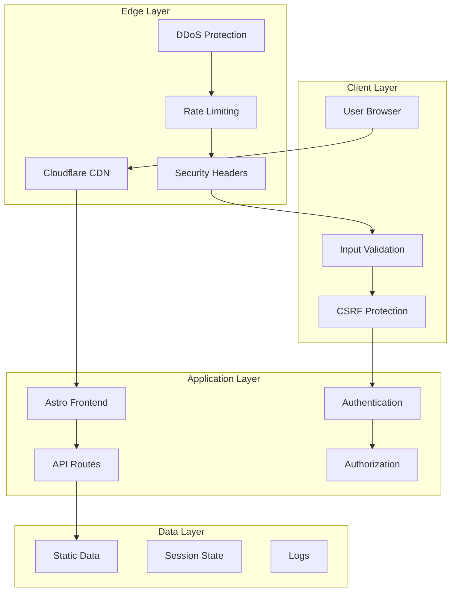

# Security and Compliance Guide
Qatar Airways Stopover AI Agent

## Security Overview

This document outlines the security measures, compliance requirements, and best practices implemented in the Qatar Airways Stopover AI Agent application.

## Security Architecture

### 1. Application Security Model



### 2. Security Layers

#### Edge Security (Cloudflare)
- **DDoS Protection**: Automatic mitigation of distributed attacks
- **Web Application Firewall (WAF)**: Protection against common web vulnerabilities
- **Bot Management**: Identification and blocking of malicious bots
- **SSL/TLS Termination**: Encryption in transit with modern cipher suites

#### Application Security
- **Input Validation**: Comprehensive sanitization of user inputs
- **Rate Limiting**: API endpoint protection against abuse
- **CORS Policy**: Strict cross-origin resource sharing controls
- **Security Headers**: Implementation of security-focused HTTP headers

#### Data Security
- **No PII Storage**: Minimal personal data handling
- **Secure Transmission**: HTTPS enforcement for all communications
- **API Key Protection**: Secure storage and rotation of sensitive credentials

## Security Implementation

### 1. HTTP Security Headers

#### Implemented Headers
```typescript
// Security headers configuration
const securityHeaders = {
  // Prevent XSS attacks
  'X-XSS-Protection': '1; mode=block',
  
  // Prevent MIME type sniffing
  'X-Content-Type-Options': 'nosniff',
  
  // Prevent clickjacking
  'X-Frame-Options': 'DENY',
  
  // Enforce HTTPS
  'Strict-Transport-Security': 'max-age=31536000; includeSubDomains; preload',
  
  // Content Security Policy
  'Content-Security-Policy': [
    "default-src 'self'",
    "script-src 'self' 'unsafe-inline' 'unsafe-eval' https://openrouter.ai",
    "style-src 'self' 'unsafe-inline' https://fonts.googleapis.com",
    "font-src 'self' https://fonts.gstatic.com",
    "img-src 'self' data: https: blob:",
    "connect-src 'self' https://openrouter.ai https://api.openai.com",
    "media-src 'self'",
    "object-src 'none'",
    "base-uri 'self'",
    "form-action 'self'",
    "frame-ancestors 'none'"
  ].join('; '),
  
  // Referrer Policy
  'Referrer-Policy': 'strict-origin-when-cross-origin',
  
  // Permissions Policy
  'Permissions-Policy': 'camera=(), microphone=(), geolocation=()'
};
```

#### Security Header Validation
- **HSTS**: Enforces HTTPS with 1-year max-age
- **CSP**: Restricts resource loading to trusted sources
- **X-Frame-Options**: Prevents embedding in iframes
- **X-Content-Type-Options**: Prevents MIME confusion attacks

### 2. Input Validation and Sanitization

#### Client-Side Validation
```typescript
// Input sanitization function
function sanitizeInput(input: string): string {
  return input
    .replace(/<script\b[^<]*(?:(?!<\/script>)<[^<]*)*<\/script>/gi, '')
    .replace(/<iframe\b[^<]*(?:(?!<\/iframe>)<[^<]*)*<\/iframe>/gi, '')
    .replace(/javascript:/gi, '')
    .replace(/on\w+\s*=/gi, '')
    .trim();
}
```

#### Server-Side Validation
- **Request Size Limits**: Maximum 1MB request body size
- **Content Type Validation**: Strict JSON content type checking
- **Parameter Validation**: Zod schema validation for all API inputs
- **SQL Injection Prevention**: Parameterized queries (when database is added)

### 3. Rate Limiting

#### Implementation
```typescript
// Rate limiting configuration
const rateLimits = {
  requestsPerMinute: 60,
  requestsPerHour: 1000,
  burstSize: 10,
  
  // Different limits for different endpoints
  endpoints: {
    '/api/chat': { rpm: 30, rph: 500 },
    '/api/static-data': { rpm: 100, rph: 2000 }
  }
};
```

#### Rate Limiting Strategy
- **Per-IP Limiting**: Based on client IP address
- **Sliding Window**: More accurate than fixed windows
- **Burst Handling**: Allows short bursts within limits
- **Graceful Degradation**: Informative error messages

### 4. CORS (Cross-Origin Resource Sharing)

#### Configuration
```typescript
// CORS policy configuration
const corsPolicy = {
  origins: [
    'https://qatar-stopover-ai-agent.pages.dev',
    'https://your-custom-domain.com'
  ],
  methods: ['GET', 'POST', 'PUT', 'DELETE', 'OPTIONS'],
  headers: ['Content-Type', 'Authorization', 'X-Requested-With'],
  credentials: true,
  maxAge: 86400 // 24 hours
};
```

#### CORS Security Measures
- **Whitelist Approach**: Only allowed origins can access resources
- **Credential Handling**: Secure cookie and authentication handling
- **Preflight Caching**: Optimized OPTIONS request handling

### 5. API Security

#### Authentication (Future Implementation)
```typescript
// JWT token validation (for future use)
interface AuthToken {
  sub: string;        // User ID
  iat: number;        // Issued at
  exp: number;        // Expiration
  scope: string[];    // Permissions
}
```

#### Authorization Patterns
- **Role-Based Access Control (RBAC)**: Different access levels
- **Principle of Least Privilege**: Minimal required permissions
- **Token Expiration**: Short-lived access tokens
- **Refresh Token Rotation**: Secure token renewal

## Compliance Requirements

### 1. Data Protection Compliance

#### GDPR Compliance (EU Users)
- **Data Minimization**: Only collect necessary data
- **Purpose Limitation**: Use data only for stated purposes
- **Storage Limitation**: Retain data only as long as necessary
- **Right to Erasure**: Ability to delete user data
- **Data Portability**: Export user data in standard formats

#### CCPA Compliance (California Users)
- **Transparency**: Clear privacy policy and data usage
- **Opt-Out Rights**: Allow users to opt out of data sale
- **Non-Discrimination**: No penalties for exercising privacy rights
- **Data Access**: Provide access to collected personal information

### 2. PII (Personally Identifiable Information) Handling

#### Data Classification
```typescript
// PII data classification
enum DataClassification {
  PUBLIC = 'public',           // No restrictions
  INTERNAL = 'internal',       // Company internal use
  CONFIDENTIAL = 'confidential', // Limited access
  RESTRICTED = 'restricted'    // Highest security
}

// PII handling guidelines
const piiHandling = {
  collection: 'minimal',       // Collect only what's necessary
  storage: 'encrypted',        // Encrypt at rest
  transmission: 'https',       // Encrypt in transit
  retention: '30-days',        // Automatic deletion
  access: 'role-based'         // Controlled access
};
```

#### PII Protection Measures
- **Data Encryption**: AES-256 encryption for sensitive data
- **Access Logging**: Audit trail for all PII access
- **Data Masking**: Hide sensitive data in logs and displays
- **Secure Deletion**: Cryptographic erasure of deleted data

### 3. Industry Standards Compliance

#### OWASP Top 10 Mitigation
1. **Injection**: Input validation and parameterized queries
2. **Broken Authentication**: Secure session management
3. **Sensitive Data Exposure**: Encryption and secure storage
4. **XML External Entities**: Input validation and safe parsing
5. **Broken Access Control**: Proper authorization checks
6. **Security Misconfiguration**: Secure defaults and hardening
7. **Cross-Site Scripting**: Input sanitization and CSP
8. **Insecure Deserialization**: Safe deserialization practices
9. **Known Vulnerabilities**: Regular dependency updates
10. **Insufficient Logging**: Comprehensive audit logging

#### SOC 2 Type II Readiness
- **Security**: Access controls and monitoring
- **Availability**: Uptime and disaster recovery
- **Processing Integrity**: Data accuracy and completeness
- **Confidentiality**: Data protection and access controls
- **Privacy**: PII handling and user rights

## Security Monitoring and Incident Response

### 1. Security Monitoring

#### Real-Time Monitoring
```typescript
// Security event monitoring
const securityEvents = {
  // Authentication events
  loginAttempts: 'track_failed_logins',
  bruteForce: 'detect_brute_force_attacks',
  
  // API security events
  rateLimitExceeded: 'track_rate_limit_violations',
  invalidRequests: 'track_malformed_requests',
  
  // Application security events
  xssAttempts: 'detect_xss_attempts',
  sqlInjection: 'detect_sql_injection_attempts',
  
  // Infrastructure events
  ddosAttacks: 'detect_ddos_patterns',
  anomalousTraffic: 'detect_traffic_anomalies'
};
```

#### Security Metrics
- **Failed Authentication Attempts**: Monitor for brute force attacks
- **Rate Limit Violations**: Track API abuse attempts
- **Error Rates**: Identify potential security issues
- **Response Times**: Detect performance-based attacks

### 2. Incident Response Plan

#### Incident Classification
- **P0 - Critical**: Active security breach, data exposure
- **P1 - High**: Potential security vulnerability, service disruption
- **P2 - Medium**: Security policy violation, minor vulnerability
- **P3 - Low**: Security awareness, policy updates

#### Response Procedures
1. **Detection**: Automated monitoring and manual reporting
2. **Assessment**: Determine severity and impact
3. **Containment**: Isolate affected systems
4. **Eradication**: Remove threat and vulnerabilities
5. **Recovery**: Restore normal operations
6. **Lessons Learned**: Post-incident review and improvements

### 3. Security Audit and Testing

#### Regular Security Assessments
- **Vulnerability Scanning**: Automated security scans
- **Penetration Testing**: Manual security testing
- **Code Reviews**: Security-focused code analysis
- **Dependency Audits**: Third-party library security checks

#### Security Testing Schedule
- **Daily**: Automated vulnerability scans
- **Weekly**: Dependency security updates
- **Monthly**: Security configuration reviews
- **Quarterly**: Penetration testing
- **Annually**: Comprehensive security audit

## API Key and Secrets Management

### 1. API Key Security

#### OpenRouter API Key Management
```typescript
// API key security practices
const apiKeySecurity = {
  storage: 'environment_variables',    // Never in code
  rotation: 'quarterly',               // Regular rotation
  monitoring: 'usage_tracking',        // Monitor for abuse
  access: 'principle_of_least_privilege' // Minimal permissions
};
```

#### Key Rotation Process
1. **Generate New Key**: Create new API key in OpenRouter
2. **Update Environment**: Add new key to staging environment
3. **Test Functionality**: Verify all features work with new key
4. **Deploy to Production**: Update production environment
5. **Revoke Old Key**: Remove old key from OpenRouter
6. **Monitor**: Ensure no issues with new key

### 2. Environment Variable Security

#### Secure Storage
- **Cloudflare Environment Variables**: Encrypted at rest
- **Access Control**: Limited to authorized personnel
- **Audit Logging**: Track all environment variable changes
- **Version Control**: Never commit secrets to git

#### Secret Categories
```typescript
// Secret classification and handling
const secretTypes = {
  apiKeys: {
    classification: 'restricted',
    rotation: 'quarterly',
    access: 'service_accounts_only'
  },
  
  encryptionKeys: {
    classification: 'restricted',
    rotation: 'annually',
    access: 'security_team_only'
  },
  
  certificates: {
    classification: 'confidential',
    rotation: 'before_expiry',
    access: 'infrastructure_team'
  }
};
```

## Privacy and Data Handling

### 1. Data Collection Principles

#### Minimal Data Collection
- **Purpose Limitation**: Collect only data necessary for functionality
- **Data Minimization**: Reduce data collection to absolute minimum
- **Consent Management**: Clear opt-in for any data collection
- **Transparency**: Clear communication about data usage

#### Data Types and Handling
```typescript
// Data handling matrix
const dataHandling = {
  conversationData: {
    retention: '24-hours',
    encryption: 'in-transit-only',
    purpose: 'service_delivery',
    sharing: 'none'
  },
  
  analyticsData: {
    retention: '90-days',
    encryption: 'aggregated-only',
    purpose: 'service_improvement',
    sharing: 'anonymized-only'
  },
  
  errorLogs: {
    retention: '30-days',
    encryption: 'full',
    purpose: 'debugging',
    sharing: 'none'
  }
};
```

### 2. Privacy by Design

#### Implementation Principles
- **Default Privacy**: Secure and private by default
- **Privacy Embedded**: Built into system design
- **Full Functionality**: No trade-offs with functionality
- **End-to-End Security**: Comprehensive protection
- **Visibility and Transparency**: Clear privacy practices
- **Respect for User Privacy**: User-centric approach

## Security Checklist

### Pre-Deployment Security Review
- [ ] Security headers implemented and tested
- [ ] Input validation and sanitization in place
- [ ] Rate limiting configured and functional
- [ ] CORS policy properly configured
- [ ] API keys securely stored and rotated
- [ ] HTTPS enforced across all endpoints
- [ ] Error handling doesn't expose sensitive information
- [ ] Logging configured without PII exposure
- [ ] Security monitoring and alerting active
- [ ] Incident response procedures documented

### Production Security Monitoring
- [ ] Failed authentication attempts monitored
- [ ] Rate limit violations tracked
- [ ] Unusual traffic patterns detected
- [ ] Error rates within acceptable limits
- [ ] Security headers properly set
- [ ] SSL/TLS certificates valid and current
- [ ] API usage within expected parameters
- [ ] No sensitive data in logs
- [ ] Security patches up to date
- [ ] Backup and recovery procedures tested

### Compliance Verification
- [ ] GDPR requirements met for EU users
- [ ] CCPA requirements met for California users
- [ ] PII handling procedures documented
- [ ] Data retention policies implemented
- [ ] User consent mechanisms in place
- [ ] Data deletion procedures functional
- [ ] Privacy policy updated and accessible
- [ ] Security audit completed
- [ ] Penetration testing passed
- [ ] Vulnerability assessment clean

## Security Contact Information

### Security Team Contacts
- **Security Lead**: [security-lead@company.com]
- **Incident Response**: [incident-response@company.com]
- **Privacy Officer**: [privacy@company.com]
- **Compliance Team**: [compliance@company.com]

### Emergency Contacts
- **24/7 Security Hotline**: [emergency-security-number]
- **Incident Response Team**: [incident-response-number]
- **Legal/Compliance**: [legal-emergency-number]

### Reporting Security Issues
- **Email**: security@company.com
- **Bug Bounty**: [bug-bounty-platform]
- **Anonymous Reporting**: [anonymous-reporting-system]

---

This security and compliance guide ensures the Qatar Airways Stopover AI Agent meets industry standards for security, privacy, and regulatory compliance while maintaining a secure and trustworthy user experience.